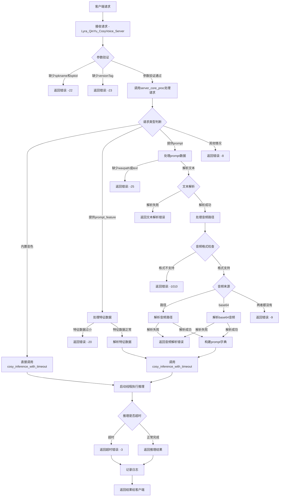

```mermaid
flowchart TD
    A[客户端请求] --> B[接收请求 - Lyra_QinYu_CosyVoice_Server]
    B --> C{参数验证}
    C -->|缺少spkname和spkid| D[返回错误: -22]
    C -->|缺少versionTag| E[返回错误: -23]
    C -->|参数验证通过| F[调用server_core_proc处理请求]
    
    F --> G{请求类型判断}
    G -->|内置音色| H[直接调用cosy_inference_with_timeout]
    G -->|提供prompt_feature| I[处理特征数据]
    I -->|特征数据过小| J[返回错误: -20]
    I -->|特征数据正常| K[解析特征数据]
    K --> L[调用cosy_inference_with_timeout]
    
    G -->|提供prompt| M[处理prompt数据]
    M -->|缺少wavpath或text| N[返回错误: -25]
    M -->|解析文本| O{文本解析}
    O -->|解析失败| P[返回文本解析错误]
    O -->|解析成功| Q[处理音频路径]
    
    Q --> R{音频格式检查}
    R -->|格式不支持| S[返回错误: -1010]
    R -->|格式支持| T{音频来源}
    T -->|路径| U[解析音频路径]
    T -->|base64| V[解析base64音频]
    T -->|两者都没有| W[返回错误: -9]
    
    U -->|解析失败| X[返回音频解析错误]
    U -->|解析成功| Y[构建prompt字典]
    V -->|解析失败| X
    V -->|解析成功| Y
    
    Y --> L
    
    G -->|其他情况| Z[返回错误: -8]
    
    H --> AA[启动线程执行推理]
    L --> AA
    
    AA --> AB{推理是否超时}
    AB -->|超时| AC[返回超时错误: -3]
    AB -->|正常完成| AD[返回推理结果]
    
    AD --> AE[记录日志]
    AC --> AE
    AE --> AF[返回结果给客户端]
```
